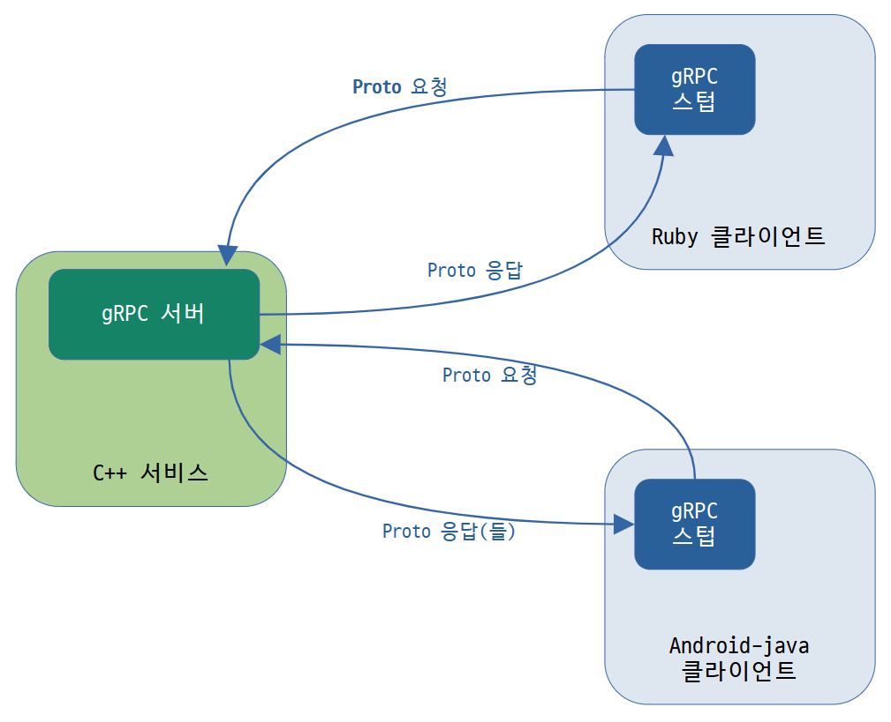

# gRPC의 소개

> 원문: https://grpc.io/docs/what-is-grpc/introduction/

#### gRPC와 프로토콜 버퍼를 소개합니다.

### 내용 >

* 개요
  * 프로토콜 버퍼와 함께 작동
* 프로토콜 버퍼 버전

이 페이지에서는 gRPC와 프로토콜 버퍼를 소개합니다. gRPC는 인터페이스 정의 언어(**IDL**) 및 기본 메시지 교환 형식으로 프로토콜 버퍼를 사용할 수 있습니다. gRPC 및/또는 프로토콜 버퍼를 처음 사용하는 경우 이 내용을 읽어보세요! 먼저 gRPC가 작동하는 모습을 보고 싶다면 [언어를 선택](../languages)하고 **빠른 시작**을 시도해보세요.


## 개요

gRPC에서 클라이언트 응용 프로그램은 마치 로컬 객체인 것처럼 다른 컴퓨터의 서버 응용 프로그램의 메서드를 직접 호출할 수 있으므로 분산 응용 프로그램 및 서비스를 더 쉽게 만들 수 있습니다. 많은 RPC 시스템에서와 같이 gRPC는 파라미터 및 반환 타입을 사용하여 원격으로 호출할 수 있는 메서드를 지정하여 서비스를 정의한다는 아이디어를 기반으로 합니다.

서버 측에서 서버는 이 인터페이스를 구현하고 gRPC 서버를 실행하여 클라이언트 호출을 처리합니다. 클라이언트 측에서 클라이언트에는 서버와 동일한 방법을 제공하는 스텁(Stub)(일부 언어에서는 클라이언트라고 함)이 있습니다. 



gRPC 클라이언트와 서버는 Google 내부의 서버에서 사용자의 데스크톱에 이르기까지 다양한 환경에서 실행되고 서로 통신할 수 있으며 gRPC에서 지원하는 모든 언어로 작성할 수 있습니다. 예를 들면 Go, Python 또는 Ruby의 클라이언트를 사용하여 Java로 gRPC 서버를 쉽게 만들 수 있습니다. 또한 최신 Google API에는 지원하는 언어의 gRPC 버전 인터페이스가 있으므로 애플리케이션에 Google 기능을 쉽게 구축할 수 있습니다.


### 프로토콜 버퍼와 함께 작동

기본적으로 gRPC는 구조화된 데이터를 직렬화하기 위한 Google의 성숙한 오픈 소스 메커니즘인 [프로토콜 버퍼](https://developers.google.com/protocol-buffers/docs/overview)를 사용합니다(JSON과 같은 다른 데이터 형식과 함께 사용할 수 있음). 여기 작동 원리에 대한 간단한 소개가 있습니다. 프로토콜 버퍼에 이미 익숙하다면 다음 섹션으로 건너뛰어도 됩니다.

프로토콜 버퍼로 작업할 때 첫 번째 단계는 *proto 파일*에서 직렬화하려는 데이터의 구조를 정의하는 것입니다: 이것은 `.proto` 확장자를 가진 일반 텍스트 파일입니다. 프로토콜 버퍼 데이터는 메시지로 구성되며, 여기서 각 메시지는 *필드*라고 하는 일련의 이름-값 쌍을 포함하는 정보의 작은 논리적 레코드입니다. 다음은 간단한 예입니다:

```protobuf
message Person {
  string name = 1;
  int32 id = 2;
  bool has_ponycopter = 3;
}
```

그런 다음 데이터 구조를 지정하고 나면 프로토콜 버퍼 컴파일러 `protoc`를 사용하여 proto 정의에서 원하는 언어로 데이터 액세스 클래스를 생성합니다. 이들은 `name()` 및 `set_name()`과 같은 각 필드에 대한 간단한 접근자와 원시 바이트에서 전체 구조를 직렬화 / 분석하는 메서드를 제공합니다. 예를 들어 선택한 언어가 C++인 경우 위의 예제에서 컴파일러를 실행하면 `Person`이라는 클래스가 생성됩니다. 그런 다음 애플리케이션에서 이 클래스를 사용하여 `Person` 프로토콜 버퍼 메시지를 채우고 직렬화하며 검색(retrieve)할 수 있습니다.  

프로토콜 버퍼 메시지로 지정된 RPC 메서드 파라미터와 반환 타입을 사용하여 평범한 `proto` 파일에서 gRPC 서비스를 정의합니다:

```protobuf
// The greeter service definition.
service Greeter {
  // Sends a greeting
  rpc SayHello (HelloRequest) returns (HelloReply) {}
}

// The request message containing the user's name.
message HelloRequest {
  string name = 1;
}

// The response message containing the greetings
message HelloReply {
  string message = 1;
}
```

gRPC는 `proto` 파일에서 코드를 생성하기 위해 특별한 gRPC 플러그인과 함께 protoc를 사용합니다: 생성된 gRPC 클라이언트 및 서버 코드와 함께 메시지 유형을 채우고 직렬화하고 검색하기 위한 일반적인 프로토콜 버퍼 코드를 얻습니다. 아래에서 이에 대한 예를 볼 수 있습니다.

선택한 언어로 gRPC 플러그인을 사용하여 protoc를 설치하는 방법을 포함하여 프로토콜 버퍼에 대해 자세히 알아보려면 [프로토콜 버퍼 설명서](https://developers.google.com/protocol-buffers/docs/overview)를 참조해보세요.


## 프로토콜 버퍼 버전

[프로토콜 버퍼](https://developers.google.com/protocol-buffers/docs/overview)는 오픈 소스 사용자가 얼마 동안 사용할 수 있었지만 이 사이트의 대부분의 예제는 약간 단순화된 구문, 몇 가지 유용한 새 기능 및 더 많은 언어를 지원하는 프로토콜 버퍼 버전 3(proto3)을 사용합니다. 현재 Proto3는 Java, C++, Dart, Python, Objective-C, C#, 라이트 런타임(Android Java), Ruby 및 [프로토콜 버퍼 GitHub 저장소](https://github.com/google/protobuf/releases)로부터 JavaScript를 사용할 수 있고, 거기에 더해서 [golang/protobuf 공식 패키지](golang/protobuf 공식 패키지)에서 Go 언어 생성기도 사용할 수 있습니다. 더 많은 언어에 대해서도 개발중 입니다. 여러분은 [proto3 언어 가이드](https://developers.google.com/protocol-buffers/docs/proto3) 및 각 언어에 대해 제공되는 [레퍼런스 문서](https://developers.google.com/protocol-buffers/docs/reference/overview)에서 자세한 내용을 확인할 수 있습니다. 레퍼런스 문서에는 `.proto` 파일 형식에 대한 [공식 사양](https://developers.google.com/protocol-buffers/docs/reference/proto3-spec)도 포함되어 있습니다.

일반적으로 proto2(현재 기본 프로토콜 버퍼 버전)를 사용할 수 있지만 gRPC와 함께 proto3를 사용하면 gRPC 지원 언어의 전체 범위를 사용할 수 있을 뿐만 아니라 proto2 클라이언트와 통신하는 호환성 문제를 피할 수 있습니다. proto3 서버와 그 반대의 경우도 마찬가지입니다. 그러므로 gRPC와 함께 proto3를 사용하는 것이 좋습니다.


## 의견 / 진행

* 문서작성 시점에 JavaScript가 기본 지원에 포함되어있지 않다는 것인지 조금 해깔린다. 그때는 protobuf 레파지토리로부터 최신 버전 받아서 써야했는지?

  